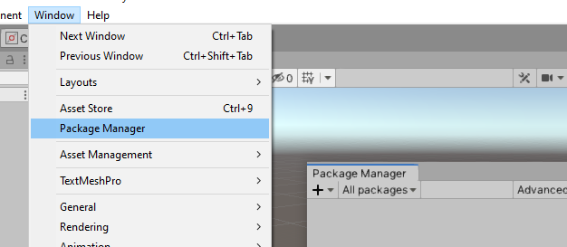
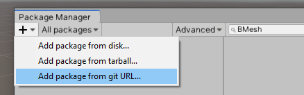
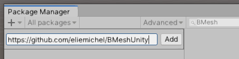
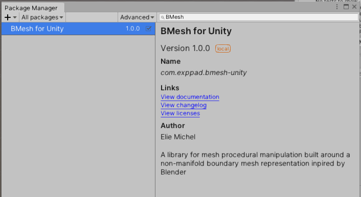
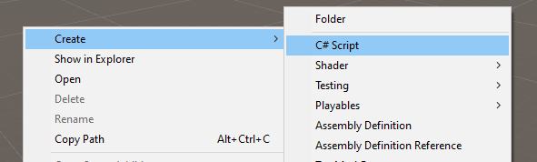
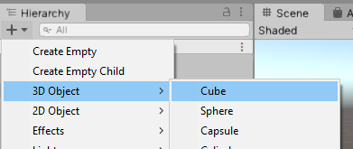
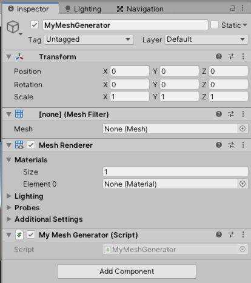
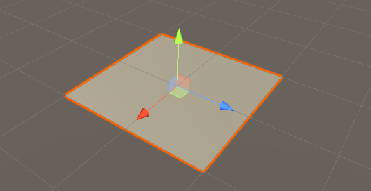
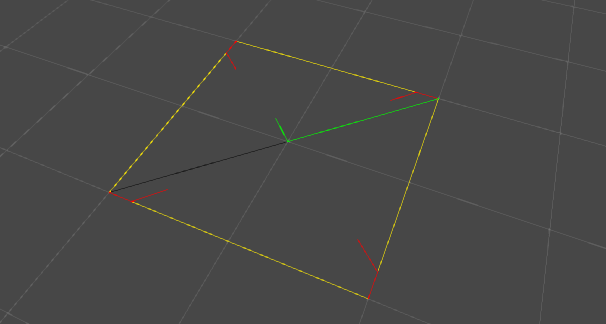
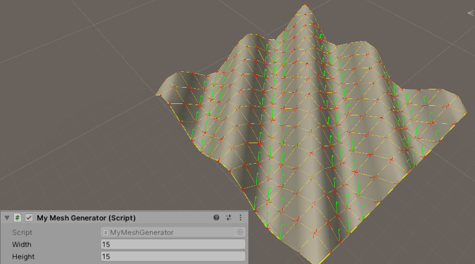

BMesh for Unity
===============

This Unity package is a library to make runtime procedural mesh generation as flexible as possible.

The mesh structure is similar to [the one used in Blender](https://wiki.blender.org/wiki/Source/Modeling/BMesh/Design), and a mechanism for adding arbitrary attributes to vertices/edges/loops/faces is available, for instance for people used to [Houdini's wrangle nodes](https://www.sidefx.com/docs/houdini/nodes/sop/attribwrangle.html).

Getting Started
---------------

### Installation

This is a standard git-based package:

  1. Open the package manager.



  2. Click on "+" in the upper-left corner of the Package Manager, and chose "Add package from git URL..."



 3. In the text field, paste `https://github.com/eliemichel/BMeshUnity`:



You should now see the BMesh package in the Package Manager:



### First script

We start with a very simple and detailed example:

  1. Create a new script, we'll call it for instance `MyMeshGenerator.cs`:



  2. Create an object on which we will attach the script, take any 3D object, we'll replace its mesh.



  3. Add the script to the object, make sure you have at least a "MeshFilter", a "MeshRenderer" and your script "MyMeshGenerator" visible in the inspector (if one is missing, just add it).



  4. In `MyMeshGenerator.cs`, we write:

```C#
using UnityEngine;
using static BMesh; // otherwise you'll have to write "BMesh.Vertex" etc.

public class MyMeshGenerator : MonoBehaviour
{
    void Start()
    {
        // Create a new empty mesh
        BMesh mesh = new BMesh();

        // Add a few vertices
        Vertex v1 = mesh.AddVertex(-1, 0, -1);
        Vertex v2 = mesh.AddVertex( 1, 0, -1);
        Vertex v3 = mesh.AddVertex( 1, 0,  1);
        Vertex v4 = mesh.AddVertex(-1, 0,  1);

        // Add a face using the vertices
        mesh.AddFace(v1, v2, v3, v4);

        // Set the current mesh filter to use our generated mesh
        BMeshUnity.SetInMeshFilter(mesh, GetComponent<MeshFilter>());
    }
}
```

Don't forget the `SetInMeshFilter` to make the mesh visible in the game. A `BMesh` is a mesh optimized for procedural generation and manipulation, but not for rendering. This line converts it to the rendering-oriented mesh structure used by Unity and replace the previous mesh with it in the "MeshFilter" component. You should now see a plane *when starting the game*:



At this point, the BMesh structure is destructed as soon as the `Start()` function is done, so that all we are left is the rendering-oriented Mesh. This is good in general, but for debugging it can quickly become usefull to keep a reference to it, for instance to draw debug information in the viewport:

```C#
using UnityEngine;
using static BMesh; // otherwise you'll have to write "BMesh.Vertex" etc.

public class MyMeshGenerator : MonoBehaviour
{
    BMesh mesh; // We keep a reference to the BMesh

    void Start()
    {
        mesh = new BMesh();
        Vertex v1 = mesh.AddVertex(-1, 0, -1);
        Vertex v2 = mesh.AddVertex( 1, 0, -1);
        Vertex v3 = mesh.AddVertex( 1, 0,  1);
        Vertex v4 = mesh.AddVertex(-1, 0,  1);
        mesh.AddFace(v1, v2, v3, v4);

        // Set the current mesh filter to use our generated mesh
        BMeshUnity.SetInMeshFilter(mesh, GetComponent<MeshFilter>());
    }

    // In the editor, draw some debug information about the mesh
    private void OnDrawGizmos()
    {
        if (mesh != null)
        {
        	Gizmos.matrix = transform.localToWorldMatrix;
            BMeshUnity.DrawGizmos(mesh);
        }
    }
}
```

Thus in the viewport you can now see some debug overlay showing the BMesh' edges, loops, etc. This can be even used for BMeshes that are not yet set in a mesh filter.



### A sligthly more advanced example



```C#
using UnityEngine;
using static BMesh;

public class MyMeshGenerator : MonoBehaviour
{
    public int width = 15;
    public int height = 15;

    BMesh mesh;

    BMesh GenerateGrid() {
        BMesh bm = new BMesh();
        for (int j = 0; j < height; ++j) {
            for (int i = 0; i < width; ++i) {
                bm.AddVertex(i, 0, j); // vertex # i + j * w
                if (i > 0 && j > 0) bm.AddFace(i + j * width, i - 1 + j * width, i - 1 + (j - 1) * width, i + (j - 1) * width);
            }
        }
        return bm;
    }

    void Start() {
        mesh = GenerateGrid();
        foreach (Vertex v in mesh.vertices) {
            v.point.y = Mathf.Sin(v.point.x + v.point.z); // Vertical displacement
        }
        BMeshUnity.SetInMeshFilter(mesh, GetComponent<MeshFilter>());
    }

    private void OnDrawGizmos() {
        Gizmos.matrix = transform.localToWorldMatrix;
        if (mesh != null) BMeshUnity.DrawGizmos(mesh);
    }
}
```

Going further
-------------

Now that you know the basics, you can simply look at the source files, they are commented before each function.

Contributing
------------

This library is still young, and far from being a complete toolkit. Whenever you find yourself writing operators that are somehow reusable, you are more than welcome to contribute back, by sending a pull request here for instance. Contribution can also be the identification of weak parts of the current design of the library.
